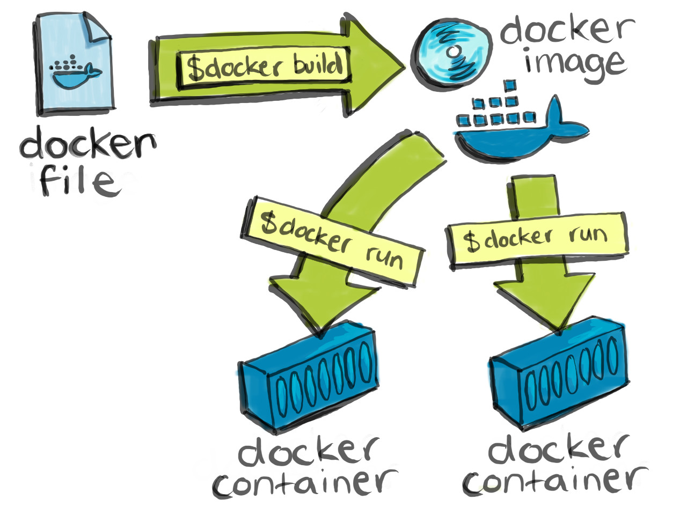

## What is Docker?
[Docker](https://www.docker.com/) is an open source platform for developing, deploying, and 
running applications inside standardized units of software called containers. Docker is 
essentially synonymous with the process of containerization. If you’re a current or aspiring 
(research) software engineer or (data) scientist, Docker is in your future.

## What is a `Dockerfile`?
A `Dockerfile` is a text document that contains all the commands a user could call on the command 
line to assemble an Docker container image. You can think of a `Dockerfile` as a recipe that 
explains how to combine individual ingredients (i.e., individual commands or groups of commands) 
into layers which can then be merged to produce a single immutable container image. Here is an 
example of a `Dockerfile` from the [Rocker project](https://github.com/rocker-org/rocker). 

~~~
FROM rocker/rstudio:3.6.0

RUN apt-get update -qq && apt-get -y --no-install-recommends install \
  libxml2-dev \
  libcairo2-dev \
  libsqlite3-dev \
  libmariadbd-dev \
  libmariadb-client-lgpl-dev \
  libpq-dev \
  libssh2-1-dev \
  unixodbc-dev \
  libsasl2-dev \
  && install2.r --error \
    --deps TRUE \
    tidyverse \
    dplyr \
    devtools \
    formatR \
    remotes \
    selectr \
    caTools \
    BiocManager
~~~

This `Dockerfile` describes how to install the popular [tidyverse](https://www.tidyverse.org/) libraries (and their required dependencies!) on top of a Docker container image containing version 3.6 of RStudio. 

Here is another, more involved `Dockerfile` prepared by the kind folks at the 
[Jupyter](https://github.com/jupyter/docker-stacks) project. 
~~~
# Copyright (c) Jupyter Development Team.
# Distributed under the terms of the Modified BSD License.
ARG BASE_CONTAINER=jupyter/scipy-notebook
FROM $BASE_CONTAINER

LABEL maintainer="Jupyter Project <jupyter@googlegroups.com>"

# Set when building on Travis so that certain long-running build steps can
# be skipped to shorten build time.
ARG TEST_ONLY_BUILD

USER root

# R pre-requisites
RUN apt-get update && \
    apt-get install -y --no-install-recommends \
    fonts-dejavu \
    gfortran \
    gcc && \
    rm -rf /var/lib/apt/lists/*

# Julia dependencies
# install Julia packages in /opt/julia instead of $HOME
ENV JULIA_DEPOT_PATH=/opt/julia
ENV JULIA_PKGDIR=/opt/julia
ENV JULIA_VERSION=1.1.0

RUN mkdir /opt/julia-${JULIA_VERSION} && \
    cd /tmp && \
    wget -q https://julialang-s3.julialang.org/bin/linux/x64/`echo ${JULIA_VERSION} | cut -d. -f 1,2`/julia-${JULIA_VERSION}-linux-x86_64.tar.gz && \
    echo "80cfd013e526b5145ec3254920afd89bb459f1db7a2a3f21849125af20c05471 *julia-${JULIA_VERSION}-linux-x86_64.tar.gz" | sha256sum -c - && \
    tar xzf julia-${JULIA_VERSION}-linux-x86_64.tar.gz -C /opt/julia-${JULIA_VERSION} --strip-components=1 && \
    rm /tmp/julia-${JULIA_VERSION}-linux-x86_64.tar.gz
RUN ln -fs /opt/julia-*/bin/julia /usr/local/bin/julia

# Show Julia where conda libraries are \
RUN mkdir /etc/julia && \
    echo "push!(Libdl.DL_LOAD_PATH, \"$CONDA_DIR/lib\")" >> /etc/julia/juliarc.jl && \
    # Create JULIA_PKGDIR \
    mkdir $JULIA_PKGDIR && \
    chown $NB_USER $JULIA_PKGDIR && \
    fix-permissions $JULIA_PKGDIR

USER $NB_UID

# R packages including IRKernel which gets installed globally.
RUN conda install --quiet --yes \
    'rpy2=2.9*' \
    'r-base=3.5.1' \
    'r-irkernel=0.8*' \
    'r-plyr=1.8*' \
    'r-devtools=1.13*' \
    'r-tidyverse=1.2*' \
    'r-shiny=1.2*' \
    'r-rmarkdown=1.11*' \
    'r-forecast=8.2*' \
    'r-rsqlite=2.1*' \
    'r-reshape2=1.4*' \
    'r-nycflights13=1.0*' \
    'r-caret=6.0*' \
    'r-rcurl=1.95*' \
    'r-crayon=1.3*' \
    'r-randomforest=4.6*' \
    'r-htmltools=0.3*' \
    'r-sparklyr=0.9*' \
    'r-htmlwidgets=1.2*' \
    'r-hexbin=1.27*' && \
    conda clean --all -f -y && \
    fix-permissions $CONDA_DIR && \
    fix-permissions /home/$NB_USER

# Add Julia packages. Only add HDF5 if this is not a test-only build since
# it takes roughly half the entire build time of all of the images on Travis
# to add this one package and often causes Travis to timeout.
#
# Install IJulia as jovyan and then move the kernelspec out
# to the system share location. Avoids problems with runtime UID change not
# taking effect properly on the .local folder in the jovyan home dir.
RUN julia -e 'import Pkg; Pkg.update()' && \
    (test $TEST_ONLY_BUILD || julia -e 'import Pkg; Pkg.add("HDF5")') && \
    julia -e "using Pkg; pkg\"add Gadfly RDatasets IJulia InstantiateFromURL\"; pkg\"precompile\"" && \ 
    # move kernelspec out of home \
    mv $HOME/.local/share/jupyter/kernels/julia* $CONDA_DIR/share/jupyter/kernels/ && \
    chmod -R go+rx $CONDA_DIR/share/jupyter && \
    rm -rf $HOME/.local && \
    fix-permissions $JULIA_PKGDIR $CONDA_DIR/share/jupyter
~~~

This `Dockerfile` describes how to install the following on top of the `jupyter/scipy-notebook` Docker container image which contains Python 3 as well as the most widely used Python data science packages. 

* Version 3.5.1 of the [R](https://www.r-project.org/) programming language together with a large number of popular R data science libraries.
* Version 1.1 of the [Julia](https://julialang.org/) programming language.

We will be covering Dockerfiles in quite a bit of detail in a later episode of this lesson where you will learn when and how to write your own `Dockerfile`.

## What is a container image?
A Docker container image is a lightweight, standalone, executable package of software that 
includes everything needed to run an application: code, runtime, system tools, system libraries 
and settings.

Docker container images are created from Dockerfiles.

## What is a container?
A container is a standard unit of software that packages up your code and all its dependencies so 
the application runs quickly and reliably from one computing environment to another. 

> ## What is the difference between a container image and a container?
> A container image is an immutable master template containing all the libraries and code that your 
> research application needs to run bundled together. Once created a container image can be used 
> as a "blueprint" to individual containers that are exact copies of one another. 
{: .callout}

### Containers vs. Virtual Machines (VMs)
 

    

 
VMs are the precursors to Docker containers. Like Docker containers, VMs machines are a 
technology for isolating an application and its dependencies from other applications and 
dependencies running on the same host OS. However, Docker containers are have several benefits 
over VMs.
 
* Containers require fewer resources from the host OS than do VMs 
* Containers are very portable relative to VMs 
* Containers are faster to spin up than VMs 

For more details on the similarities and differences between containers and VMs have a read 
through [this article](introduction-to-containers-and-vms) on *Medium*.
 
> ## Containers and VMs are *not* mutually exclusive
>
> Public cloud providers such as AWS, GCP, and Azure almost always combine VMs and containers.
{: .callout}

## What is a container registry?
If you want other people to be able to make containers from your image, you need to store them in a container registry. A container registry is a remote location where container images are stored. In the same way in which you push source code changes from you local Git repository to a remote repository on GitHub and pull changes from remote GitHub repositories to your local Git repository, youwill  push container images to a registry and pull images from a registry. You can host your own registry or use a provider’s registry. For example, AWS and Google Cloud have registries. [Docker Hub](https://www.docker.com/products/docker-hub) is the largest registry and the default.

## Putting it all together

    

## Why should I use Docker containers as part of my research workflow?
Containers help improve reproducibility and scalability of software development and (data) science 
workflows. Containerized software will always run the same, regardless of the infrastructure. 
Containers isolate software from its environment and ensure that it works uniformly despite 
differences between, for example, the host operating system on you local machine and the host 
operating system on a remote cluster.

## Motivating examples using Jupyter-Stacks and Rocker
Objective is to show learners how I use Docker as part of my develoment workflow to produce reproducible data science pipelines.

## Where do we go from here?
Now that we have had an overview of the Docker conceptual landscape, we are going to see some examples of how Docker is enabling innovation in tools that are bringing substantial value to the scientific research community.

[introduction-to-containers-and-vms]: https://medium.freecodecamp.org/a-beginner-friendly-introduction-to-containers-vms-and-docker-79a9e3e119b

