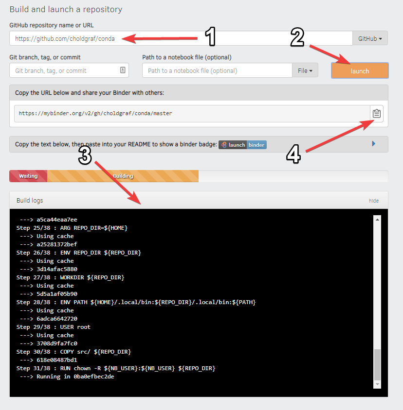

## What is the Binder Project?

The Binder Project is an open community that makes it possible to create sharable, interactive, reproducible environments. The main technical product that the community creates is called BinderHub, and one deployment of a BinderHub exists at [mybinder.org](https://mybinder.org/).

## What is a Binder?

A Binder (also called a Binder-ready repository) is a code repository that contains at least two things:

1. Code or content that you’d like people to run. This might be a Jupyter Notebook that explains an idea, or an R script that makes a visualization.
2. Configuration files for your environment. These files are used by Binder to build the environment needed to run your code. 

In this episode we will focus on configuration files for Python and R. For a list of all available configuration files see the [Configuration Files](https://mybinder.readthedocs.io/en/latest/config_files.html#config-files) page of the Binder Project documentation. A Binder repository can be built by a BinderHub, which will generate a link that you can share with others, allowing them to interact with the content in your repository.

### Binder runs on JupyterHub

Binder runs on [JupyterHub](https://jupyter.org/hub), a multi-user version of the Jupyter notebook designed for companies, classrooms, and research labs. JupyterHub is a language-agnostic tool for serving data analytics sessions in the public cloud, on remote clusters, your local workstation, even your laptop! 

Customizable - JupyterHub can be used to serve a variety of environments. It supports dozens of kernels with the Jupyter server, and can be used to serve a variety of user interfaces including the Jupyter Notebook, Jupyter Lab, RStudio, nteract, and more.

Flexible - JupyterHub can be configured with authentication in order to provide access to a subset of users. Authentication is pluggable, supporting a number of authentication protocols (such as OAuth and GitHub).

Scalable - JupyterHub is container-friendly, and can be deployed with modern-day container technology. It also runs on Kubernetes, and can run with up to tens of thousands of users.

Portable - JupyterHub is entirely open-source and designed to be run on a variety of infrastructure. This includes commercial cloud providers, virtual machines, or even your own laptop hardware.

Zero to JupyterHub with Kubernetes
https://z2jh.jupyter.org/

The littlest jupyterhub
https://tljh.jupyter.org/
https://gitter.im/jupyterhub/jupyterhub

> ## Where should I store my condifuration files?
> 
> Configuration files should be placed in either the root of your project repository or in a `binder/` folder in the project repository’s root directory (i.e. `project-dir/binder/`).
{: .callout}

### Preparing a repository for Binder?

In order to prepare your repository for use with the BinderHub at [mybinder.org](https://mybinder.org/), all you need to do is ensure that the following conditions are met:

* The repository is in a *public* location online such as [GitHub](https://github.com/) or [GitLab](https://about.gitlab.com/).
* The repository has configuration files that specify its environment.

For a list of sample repositories for use with Binder, see the [Sample Binder Repositories](https://mybinder.readthedocs.io/en/latest/sample_repos.html) page.

## A Binder example
For example, let’s take a look at a simple repository that requires a few Python packages in order to run.

### Explore the repository contents
If we inspect the contents of this repository, we see the following files:

project-dir/
├── environment.yml
├── index.ipynb
└── README.md

In this case, we have two important files:

A content file: index.ipynb is a short Jupyter Notebook that generates a plot.
An environment configuration file: environment.yml is a standard file that specifies an Anaconda environment.
Important
You may notice that environment.yml is not Binder-specific. This is intentional! Binder tries to use environment configuration files that are already standards in the data science community. For a list of all configuration files available, see the Configuration Files page.

### Get your own copy of the repository

You can find a repository with these files at the following link:

https://github.com/binder-examples/conda

To watch Binder in action, first [fork this repository](https://guides.github.com/activities/forking/). This will give you your own copy of the conda repository.

### Build your repository

Next, let’s build your Binder repository. Head to [mybinder.org](https://mybinder.org/). You’ll see a form that asks you to specify a repository for mybinder.org to build. In the first field, paste the URL of your forked repository. It’ll look something like this:

https://github.com/<your-username>/conda

Finally, click the launch button. This will ask mybinder.org to build the environment needed to run the repository. You can click on the “Build logs” button to see the logs generated by the build process.

While your Binder repository is building, note the URL that points to your unique Binder. You can share this URL with a friend, allowing them to access an interactive version of your repository.

See below for a quick layout of the BinderHub user interface.

    

If your Binder repository has already been built once, then subsequent clicks on the Binder link will not re-trigger the build process. However, if you push any changes to the repository, then it will be re-built the next time somebody clicks a link.

Now that you’re acquainted with Binder, see the Common usage patterns in Binder page for more information about what you can do with it.

### What does this have to do with Docker?



